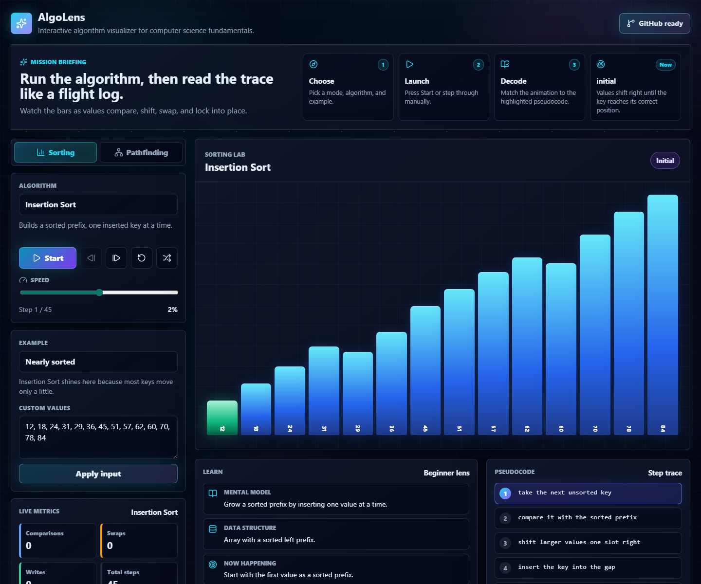

# AlgoLens

AlgoLens is a polished interactive visualizer for core computer science algorithms. It is built as a GitHub showcase project: typed algorithm modules, live animation controls, correctness tests, and a recruiter-friendly UI that opens directly into the tool.



## Features

- Sorting visualizer for Bubble Sort, Insertion Sort, Selection Sort, Merge Sort, Quick Sort, and Heap Sort.
- Pathfinding visualizer for Breadth-First Search, Depth-First Search, Dijkstra, A* Search, and Greedy Best-First Search.
- Live metrics for comparisons, swaps, writes, visited cells, path length, and path cost.
- Playback controls with start, pause, step forward, step backward, reset, randomized inputs, and adjustable speed.
- Custom sorting input with validation for learner-created examples.
- Editable pathfinding grid with wall, weight, erase, start, and end tools.
- Scenario presets with short lessons that explain what to notice.
- BFS/DFS traversal tree view with grid, tree, and split display modes.
- Pseudocode highlighting and beginner-focused learning notes for every algorithm.
- Mission Briefing guide that helps first-time visitors understand what to run and what to watch.
- Premium dark space interface with glass panels, neon states, depth, and subtle load/scroll animations.
- Deterministic algorithm outputs that are easy to test and reason about.
- Responsive dashboard layout for desktop and mobile screens.

## Tech Stack

- React 19
- TypeScript
- Vite
- Vitest
- Lucide React icons

## Getting Started

```bash
npm install
npm run dev
```

On Windows PowerShell, if `npm` is blocked by execution policy, use:

```bash
npm.cmd install
npm.cmd run dev
```

## Quality Checks

```bash
npm run lint
npm run test
npm run build
```

## Project Structure

```text
src/
  algorithms/   Pure sorting and pathfinding implementations
  components/   Reusable visualization and control components
  data/         Presets, parsers, deterministic sample arrays and grids
  test/         Unit tests for algorithm behavior
```

## What This Demonstrates

AlgoLens highlights practical computer engineering fundamentals: algorithmic complexity, graph traversal, heuristic search, typed interfaces, state-driven UI, deterministic tests, and clear project documentation. The code separates domain logic from rendering so the algorithms can be reviewed, tested, and extended independently.
